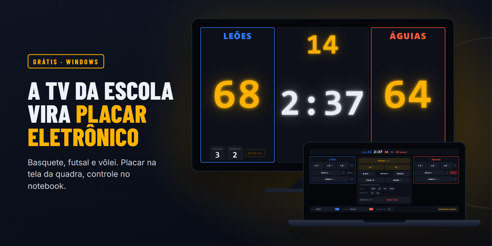
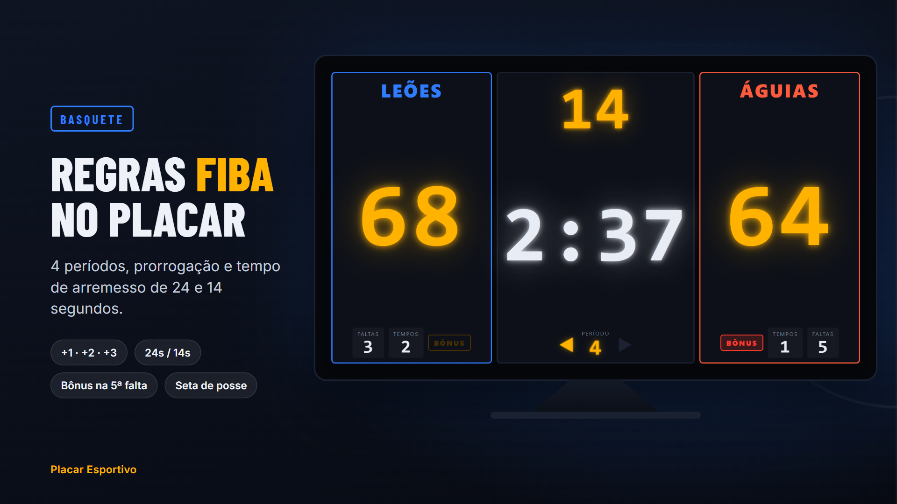
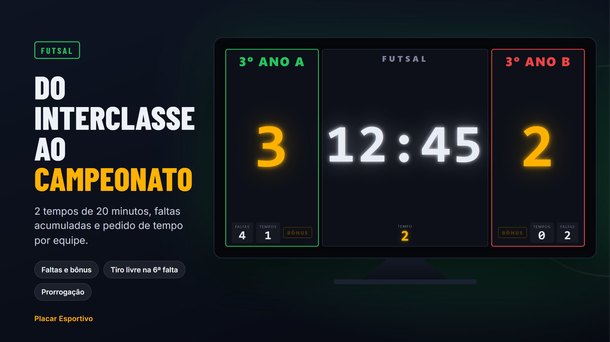
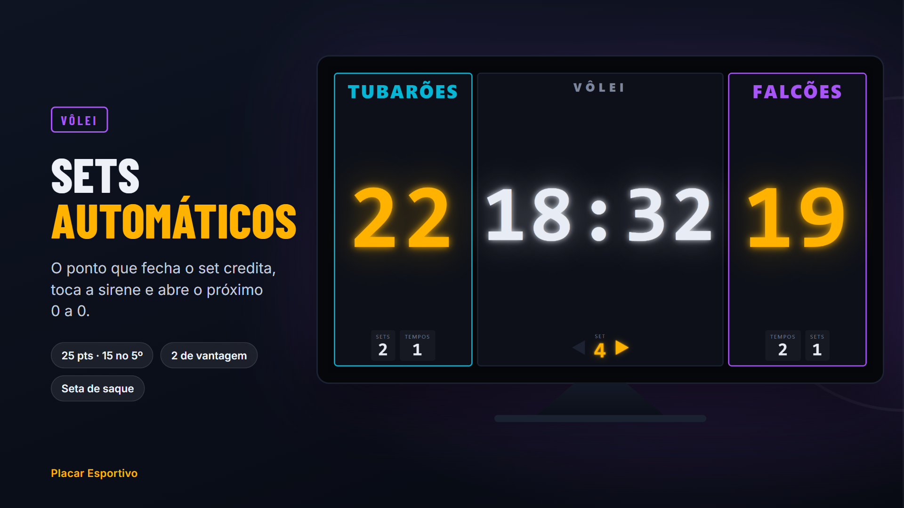
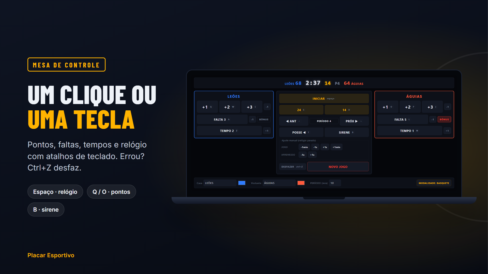
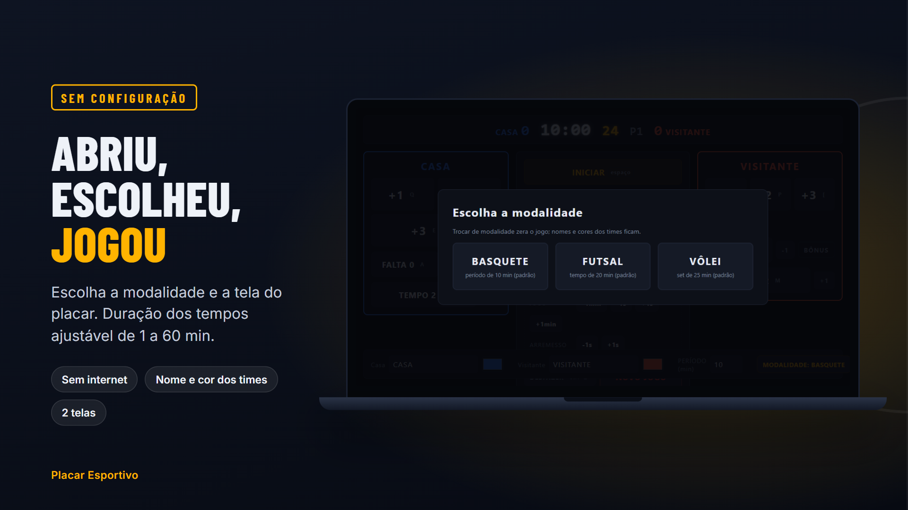

  

<h1 align="center">Placar Esportivo</h1>

  Placar eletrônico de <b>basquete, futsal e vôlei</b> para escolas, usando a TV ou o monitor que você já tem.

  
  
  

  <a href="https://github.com/whenes/placar-basquete-releases/releases/latest"><b>Baixar a versão mais recente para Windows</b></a>

---

## Placar eletrônico para escolas, sem placar físico

O **Placar Esportivo** transforma um computador e uma TV ou monitor que a escola já tem em placar eletrônico de quadra. Serve para aulas de educação física, jogos internos, interclasses e campeonatos escolares, sem precisar comprar placar de parede.

Funciona com duas telas:

- **Placar**: na TV ou no monitor virado para a quadra, em tela cheia, com números grandes para ler de longe.
- **Mesa de controle**: no notebook ou no monitor do operador, com botões e atalhos de teclado para marcar pontos, faltas e tempos e para parar o relógio.

Tudo o que é feito na mesa aparece na hora no placar. Não precisa de internet.

## Modalidades

<table>
  <tr>
    <td width="50%"></td>
    <td width="50%"></td>
  </tr>
  <tr>
    <td width="50%"></td>
    <td width="50%"></td>
  </tr>
</table>

| | Basquete | Futsal | Vôlei |
|---|---|---|---|
| Relógio | 4 períodos de 10 min | 2 tempos de 20 min | limite de set opcional |
| Pontos | +1, +2, +3 | +1 | +1, com sets automáticos |
| Extras | tempo de arremesso 24s/14s, faltas, bônus, posse | faltas e bônus | sets, pedidos de tempo e saque |

A duração dos tempos é ajustável de 1 a 60 min, para aulas e jogos mais curtos.

## Do que você precisa

- Um computador com **Windows 10 ou 11**.
- Uma **TV ou monitor** ligado ao computador (por cabo HDMI, por exemplo). Funciona com uma tela só, mas o ideal são duas: o placar para o público e o controle para o operador.

## Como instalar

1. Baixe o arquivo **`Placar-Esportivo-Setup-….exe`** na [última versão](https://github.com/whenes/placar-basquete-releases/releases/latest), em *Assets*.
2. Abra o arquivo baixado. O instalador ainda não é assinado, então o Windows pode avisar "O Windows protegeu o computador". Nesse caso, clique em **Mais informações** e depois em **Executar assim mesmo**.
3. Ao abrir o programa, escolha em qual tela fica o placar e qual é a modalidade. Pronto, é só começar o jogo.

## Atalhos principais

| Tecla | Ação |
|---|---|
| `Espaço` | inicia / pausa o relógio |
| `Q` / `O` | ponto para casa / visitante |
| `Z` / `M` | pedido de tempo casa / visitante |
| `B` | sirene |
| `Ctrl+Z` | desfaz o último comando |

## Versões

Cada versão nova é publicada em [Releases](https://github.com/whenes/placar-basquete-releases/releases). As 5 mais recentes ficam disponíveis para download.

## Licença

O Placar Esportivo é gratuito. Escolas, clubes e organizadores podem instalar em quantos computadores quiserem e usar em aulas, jogos e eventos, inclusive com ingresso pago. Não é permitido vender o programa nem distribuir uma versão modificada. O programa não traz garantia. O texto completo está em [LICENSE.txt](LICENSE.txt) e aparece também no instalador.
